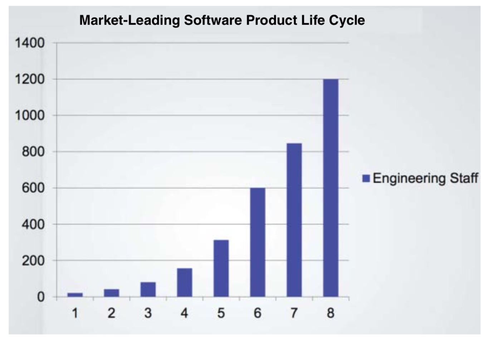
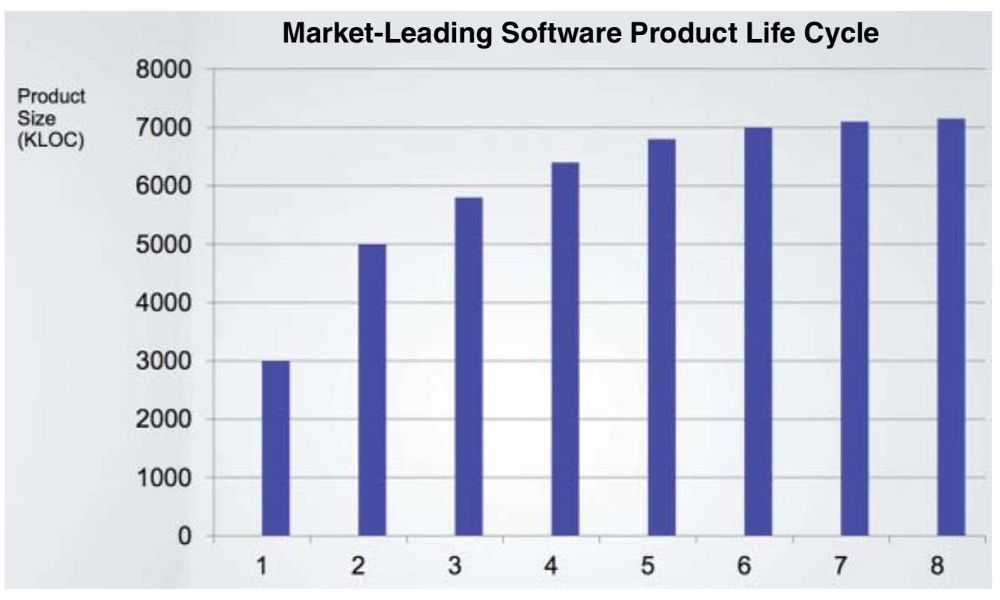
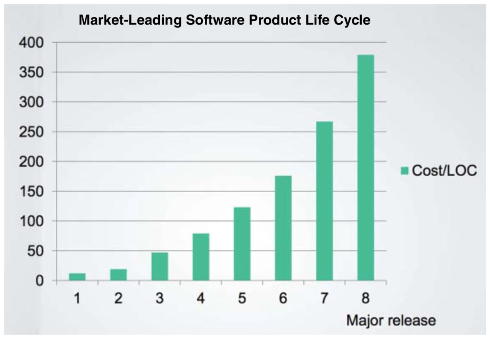
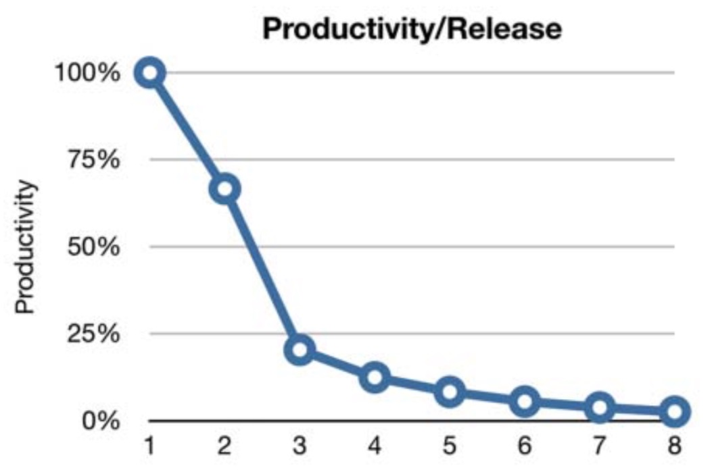
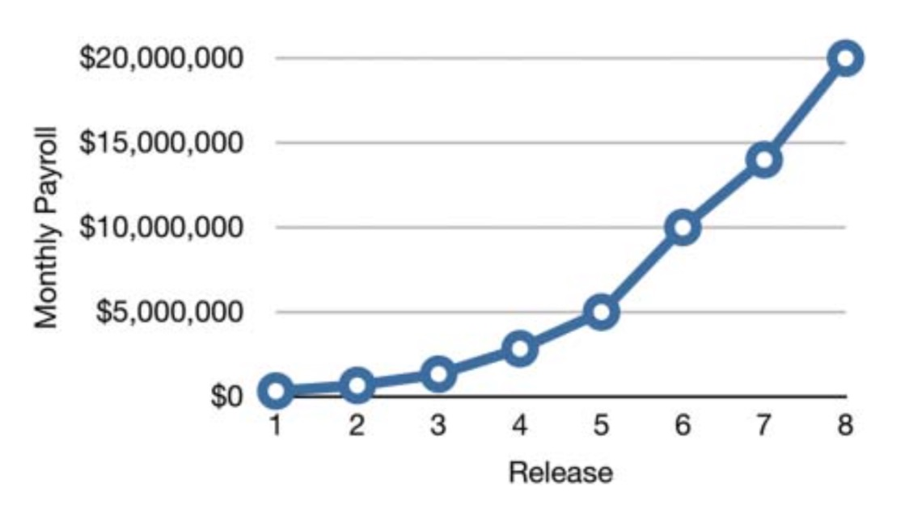
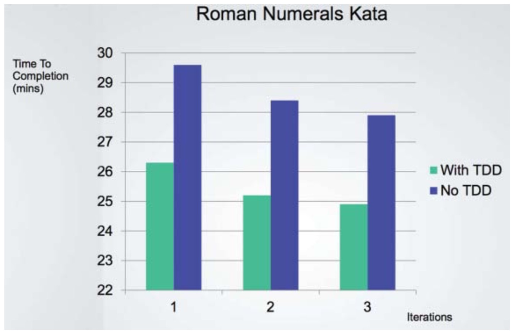

# 《Clean Architecture》 读书笔记

## 第1章 什么是设计和架构

笔者直接想聊 架构和设计的关系，一个是高层次一个是低层次的，架构是顶层设计，设计是架构的实现，更偏向细节

用了房子的设计来举例，房子有一个个房间（格局），同时它也有灯的开关，灯泡，水龙头也可以换等等； 

### 架构的最终目标
用最小的(人力,资源)成本来满足构建和维护该系统的需求 最大化程序员的生产力,同时最小化系统的总运营成本。

### 一个真实公司的例子

-   图1 迭代和雇员的关系

随着每次大版本的迭代更新（共八个版本），公司的员工也随着版本的数量增加（线性增长），从最少10人到最终1200人

-   图2 迭代和代码行数的关系

随着每次大版本的迭代更新，代码的行数开始是增长的，但到第6-8个版本的行数趋于相同

-   图3 迭代和修改代码成本的关系

随着每次大版本迭代，更改每一行代码的成本越来越高，第1个版本和第8个版本代码之间相差了40倍

-   图4 生产力和版本的关系

从100%的生产力逐步跌到10%以下

-   图5 版本和每月工资支出的关系

线性增长，从这张图5 关联到图2， 开始花的工资是足够的（它产出了代码）
但后面的工资支出越来越多，却没有任何产出？

### 哪里出错了

笔者在这一节的开头举了2000多年前的一个故事， 《龟兔赛跑》的故事
1.  慢和稳定赢得了比赛
2.  比赛和敏捷以及是否强壮没有关系
3.  越是匆忙,速度会越慢

然后用这个故事来类比前面例子的公司，他们的开发人员就好比兔子，过分的自信
于是他们的生产力越来越慢

-   图6 with-TDD和 no-TDD 两者修改代码花费的时间
